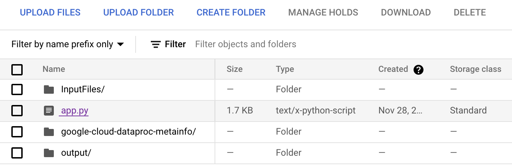
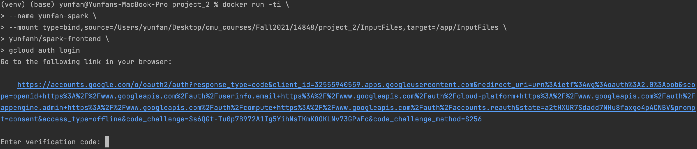
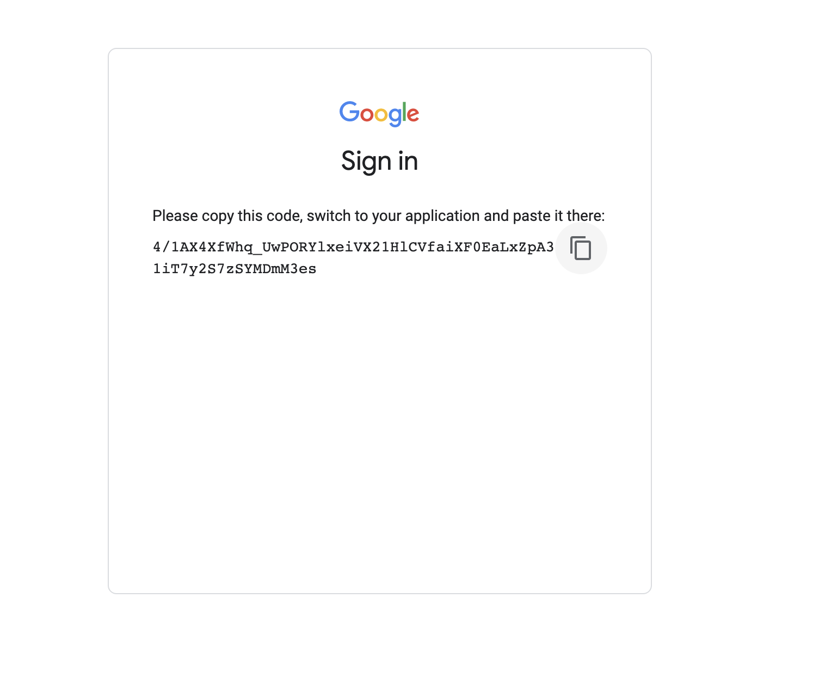

# Mini Search Engine

## Server setup
Simply upload the app.py file into the bucket of your cluster



## Client setup
### Build or pull client docker image:
Base image: https://cloud.google.com/sdk/docs/downloads-docker

My image: https://hub.docker.com/repository/docker/yunfanh/spark-frontend

#### Build from source:

change the GOOGLE_APPLICATION_CREDENTIALS in DOCKERFILE
as needed with your own service key

How to set up service key:
https://cloud.google.com/dataproc/docs/tutorials/gcs-connector-spark-tutorial
```
docker build -t yunfanh/spark-frontend .
```

### Running the client:

Before running the image, put all your input files into a 
folder and record it's path: `InputFolder`

Setting up credential for gcloud:
```
# replace the source #InputFolder here with your input folder 
# path to mount the files into the container

docker run -ti \
--name yunfan-spark \
--mount type=bind,source=#InputFolder,target=/app/InputFiles \
yunfanh/spark-frontend \
gcloud auth login
```



Next start up the container and go into it's shell:
```
docker container start yunfan-spark
docker exec -it yunfan-spark /bin/bash
```

Once in the shell, run the following command to setup the project
on gcp
```
# replace the project name with your own gcp project
gcloud config set project #projectName
```

Finally start the client and follow the prompt!
````
python3 client.py
````